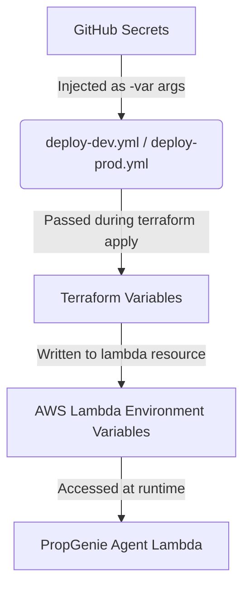

# PropGenie

AI-powered real estate search assistant for India.

## Project Structure
- `frontend/`: Next.js application (Static Export)
- `backend/`: Python LangGraph agents on AWS Lambda
- `infra/`: Terraform IaC
- `docs/`: HLD and Milestone documentation
- `prompts/`: Architecture and agent prompts

## Prerequisites
- Node.js 18+
- Python 3.12+
- AWS CLI configured
- MongoDB Atlas account

## Getting Started
### Frontend
1. `cd frontend`
2. `npm install`
3. `npm run dev`

### Backend
1. `cd backend`
2. `python -m venv .venv`
3. `source .venv/bin/activate` (or `.venv\Scripts\activate` on Windows)
4. `pip install -r requirements.txt`
5. `python server.py`

## CI/CD & Secrets Management

Automated testing and multi-environment deployment are managed using GitHub Actions and Terraform.

### 1. Required GitHub Secrets
To configure CI/CD deployments, you must add the following **7 repository secrets** under **Settings > Secrets and variables > Actions > Repository secrets** on GitHub:

| Secret Name | Description | Used In |
|---|---|---|
| `AWS_ACCESS_KEY_ID` | Access Key ID for deployment IAM user | AWS Authentication |
| `AWS_SECRET_ACCESS_KEY` | Secret Access Key for deployment IAM user | AWS Authentication |
| `AWS_REGION` | Target AWS deployment region (e.g. `ap-south-1`) | AWS Configuration |
| `MONGODB_URI` | MongoDB connection string for the database | Backend Runtime |
| `LANGFUSE_PUBLIC_KEY` | Public API key for Langfuse tracing | Observability |
| `LANGFUSE_SECRET_KEY` | Secret API key for Langfuse tracing | Observability |
| `LANGFUSE_BASE_URL` | Base URL for Langfuse instance (e.g., `https://cloud.langfuse.com`) | Observability |

### 2. GitHub Environments
Configure the following environments under **Settings > Environments**:
- **`dev`**: Used for automated continuous deployments upon merging to `main`.
- **`prod`**: Used for manual production releases.
  > [!IMPORTANT]
  > **Required Environment Protection Rules:** You must check the **Required reviewers** option for the `prod` environment and assign authorized reviewers to establish an approval gate before deployments can run.

### 3. Secrets Flow Diagram
The following flowchart illustrates how secrets are piped securely from GitHub Actions down to runtime Lambda environment variables:

### 4. CI Log Security
GitHub Actions automatically masks any variables defined as Secrets in all job run logs. Additionally:
- Terraform variables are declared as `sensitive = true` in variables definitions, which prevents their values from being printed in `terraform plan` or `terraform apply` output logs.
- The backend utilizes IP address hashing rather than raw IP logging to ensure client privacy compliance.

