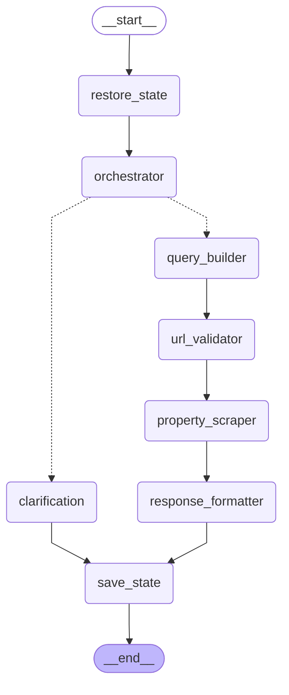

# LangGraph Workflow Topology

Below is the compiled graph structure extracted programmatically from the backend code:

```mermaid
---
config:
  flowchart:
    curve: linear
---
graph TD;
	__start__([<p>__start__</p>]):::first
	restore_state(restore_state)
	orchestrator(orchestrator)
	clarification(clarification)
	query_builder(query_builder)
	url_validator(url_validator)
	property_scraper(property_scraper)
	response_formatter(response_formatter)
	save_state(save_state)
	__end__([<p>__end__</p>]):::last
	__start__ --> restore_state;
	clarification --> save_state;
	property_scraper --> response_formatter;
	query_builder --> url_validator;
	response_formatter --> save_state;
	restore_state --> orchestrator;
	save_state --> __end__;
	url_validator --> property_scraper;
	orchestrator -.-> clarification;
	orchestrator -.-> query_builder;
	classDef default fill:#f2f0ff,line-height:1.2
	classDef first fill-opacity:0
	classDef last fill:#bfb6fc

```
