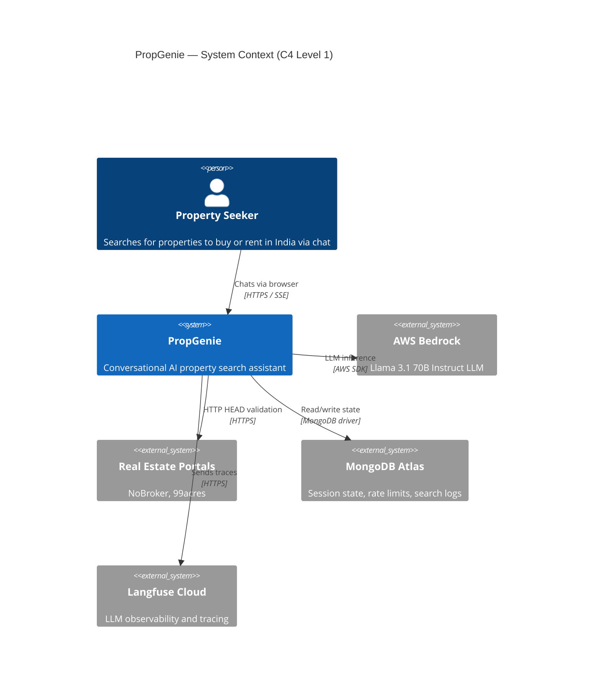
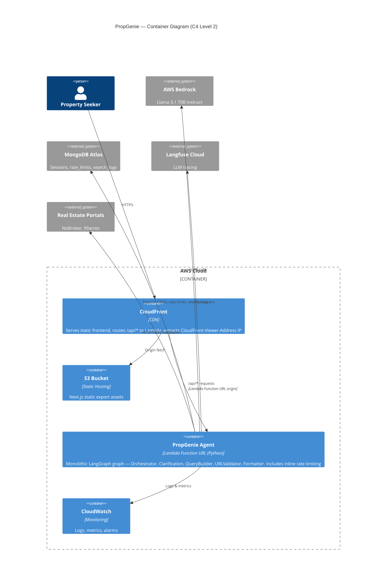
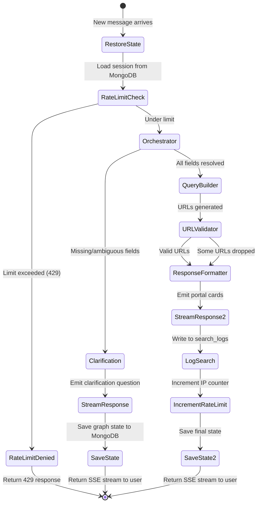

# 2. System Architecture

## 2.1 System Context Diagram (C4 Level 1)



## 2.2 Container Diagram (C4 Level 2)



## 2.3 Request Flow

```
┌──────────┐     HTTPS      ┌────────────┐    Origin     ┌─────┐
│  Browser  │──────────────►│ CloudFront  │─────────────►│ S3  │  (static assets)
│ (Next.js) │               │  (CDN)      │              └─────┘
│           │               │             │
│           │   /api/chat   │  Viewer-    │    ┌──────────────────────┐
│           │──────────────►│  Address    │──►│  PropGenie Agent      │
└──────────┘               └────────────┘    │  Lambda Function URL  │
                                              │  (LangGraph graph)    │
                                              └──────────┬────────────┘
                                                         │
                                          ┌──────────────┼──────────────┐
                                          │              │              │
                                          ▼              ▼              ▼
                                       Bedrock       MongoDB       Portals
                                       (LLM)        (state)     (HEAD check)
```

**Flow summary:**
1. Browser sends `POST /api/chat` with `X-Session-ID` header and user message body
2. CloudFront forwards to Lambda Function URL origin, injecting `CloudFront-Viewer-Address` header
3. Lambda handler extracts IP from `CloudFront-Viewer-Address`, checks rate limit in MongoDB `rate_limits`
4. If rate limit exceeded, returns 429 JSON response immediately
5. If allowed, invokes the LangGraph agent graph
6. Agent Lambda streams SSE events back to the browser via Lambda Function URL response streaming
7. On search completion, the agent increments the rate limit counter and logs the search

## 2.4 Agent Interaction — LangGraph Graph Topology



**Graph nodes (all run in a single Lambda invocation):**

| Node | Purpose | LLM call? |
|------|---------|-----------|
| `restore_state` | Load session from MongoDB, rehydrate LangGraph state | No |
| `rate_limit_check` | Check IP rate limit in MongoDB, reject if exceeded | No |
| `orchestrator` | Intent classification, entity extraction, completeness check | Yes |
| `clarification` | Generate one clarifying question | Yes |
| `query_builder` | Build portal-specific deep-link URLs | Yes (for location mapping) |
| `url_validator` | Validate URLs structurally + HTTP HEAD | No |
| `response_formatter` | Format portal cards for SSE output | No (template-based) |
| `save_state` | Persist graph state + session to MongoDB | No |
