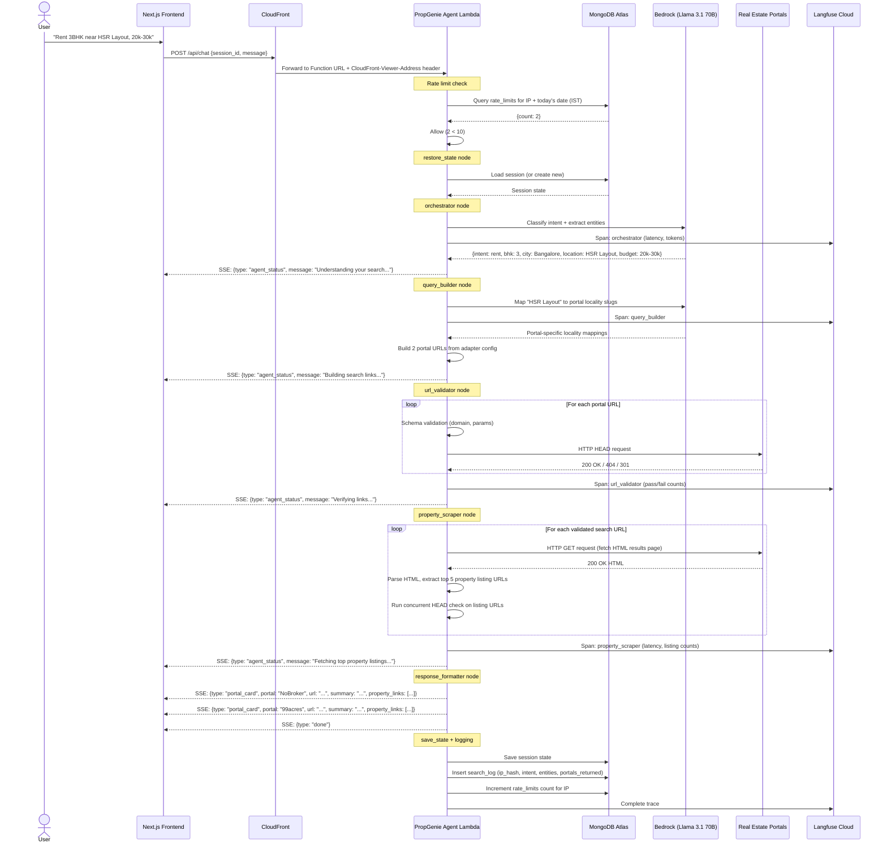
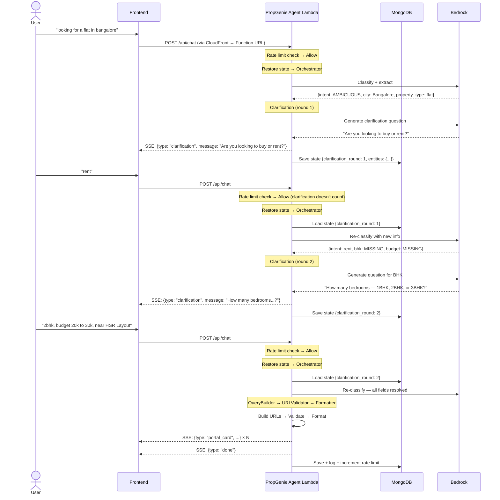
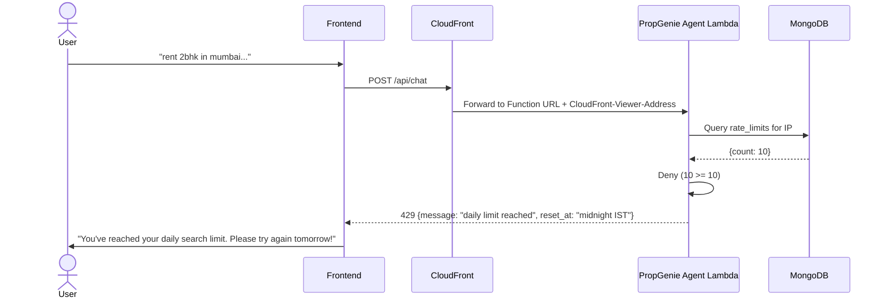
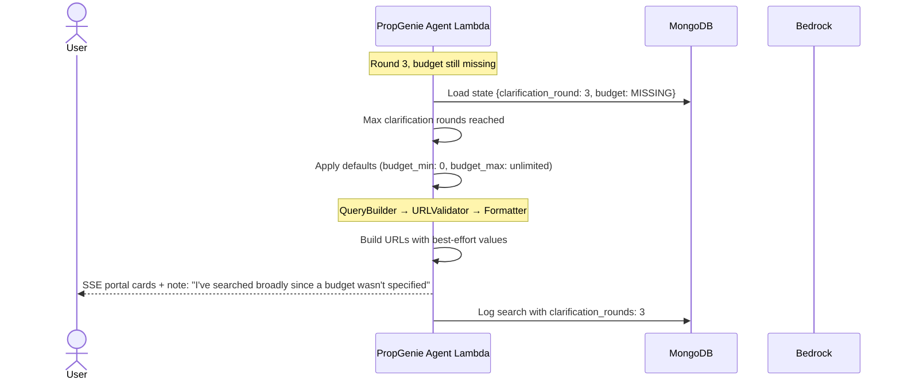

# 3. Sequence Diagrams

## 3.1 Happy Path — All Fields Resolved in First Message

## 3.2 Clarification Path — 2 Rounds

## 3.3 Rate Limit Breach Path

## 3.4 3-Round Clarification Breach — Best-Effort Fallback

