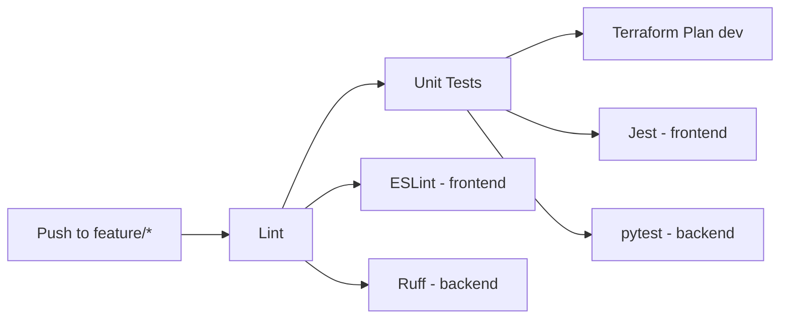
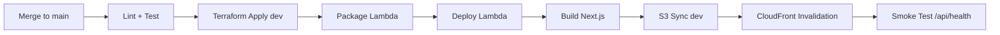
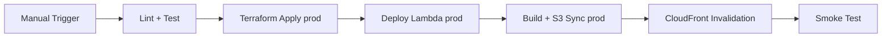

# 9. CI/CD Pipeline (GitHub Actions)

## 9.1 Mono-Repo Structure

```
PropGenie/
├── frontend/                # Next.js static export
│   ├── src/
│   │   ├── app/
│   │   ├── components/
│   │   └── lib/
│   ├── public/
│   ├── package.json
│   └── next.config.js
├── backend/                 # Python Lambda code
│   ├── agents/
│   │   ├── orchestrator.py
│   │   ├── clarification.py
│   │   ├── query_builder.py
│   │   ├── url_validator.py
│   │   └── response_formatter.py
│   ├── models/
│   │   ├── state.py          # AgentState TypedDict
│   │   └── portal_config.py  # PortalConfig Pydantic schema
│   ├── db/
│   │   ├── connection.py     # MongoDB connection pooling
│   │   ├── session_manager.py
│   │   └── search_logger.py
│   ├── utils/
│   │   ├── config_loader.py  # Portal YAML config loader
│   │   ├── rate_limiter.py   # Inline rate limit check
│   │   └── logger.py         # Structured JSON logging
│   ├── observability/
│   │   └── langfuse_tracer.py
│   ├── graph.py             # LangGraph graph definition
│   ├── handler.py           # Lambda handler entry point
│   ├── server.py            # FastAPI local dev server
│   ├── portal_configs/      # Static YAML portal adapters
│   │   ├── nobroker.yaml
│   │   └── 99acres.yaml
│   ├── requirements.txt
│   ├── requirements-dev.txt
│   ├── pyproject.toml
│   └── tests/
│       ├── conftest.py
│       ├── unit/
│       ├── integration/
│       └── performance/
├── infra/                   # Terraform modules
│   ├── backend-setup/       # One-time state backend bootstrap
│   ├── modules/
│   │   ├── frontend/
│   │   ├── lambda/
│   │   └── monitoring/
│   ├── environments/
│   │   ├── dev.tfvars
│   │   └── prod.tfvars
│   ├── main.tf
│   ├── variables.tf
│   └── outputs.tf
├── docs/                    # HLD, architecture docs
│   ├── hld/
│   └── backlog/
├── .github/
│   └── workflows/
│       ├── ci.yml           # Feature branch CI
│       ├── deploy-dev.yml   # Dev deployment
│       ├── deploy-prod.yml  # Prod deployment
│       └── portal-check.yml # Weekly portal validation
├── prompts/                 # Architecture prompts
├── .env.example             # Environment variable template
├── .gitignore
└── README.md
```

## 9.2 Pipeline Definitions

### Feature Branch (`feature/*`) — `ci.yml`



**Steps:**
1. Checkout code
2. **Frontend lint:** `npx eslint frontend/src/`
3. **Backend lint:** `ruff check backend/`
4. **Frontend tests:** `cd frontend && npm test`
5. **Backend tests:** `cd backend && pytest tests/`
6. **Terraform plan:** `terraform plan -var-file=environments/dev.tfvars`

### Main Branch Merge — `deploy-dev.yml`



**Steps:**
1. All CI steps (lint, test)
2. `terraform apply -auto-approve -var-file=environments/dev.tfvars`
3. Package Python Lambda: `pip install --platform manylinux2014_x86_64 --only-binary=:all: -r requirements.txt -t dist/ && zip`
4. Update Lambda function code via AWS CLI
5. `cd frontend && npm run build && npm run export`
6. `aws s3 sync out/ s3://propgenie-frontend-dev/`
7. `aws cloudfront create-invalidation --paths "/*"`
8. `curl -f https://<dev-domain>/api/health`

### Production Release — `deploy-prod.yml` (manual trigger)



Same as dev but with `prod.tfvars` and production S3 bucket.

## 9.3 GitHub Actions Secrets

| Secret | Used By | Purpose |
|--------|---------|---------|
| `AWS_ACCESS_KEY_ID` | All pipelines | AWS authentication |
| `AWS_SECRET_ACCESS_KEY` | All pipelines | AWS authentication |
| `AWS_REGION` | All pipelines | Target AWS region |
| `MONGODB_URI` | Deploy pipelines | Passed as Terraform variable → Lambda env var |
| `LANGFUSE_SECRET_KEY` | Deploy pipelines | Passed as Terraform variable → Lambda env var |
| `LANGFUSE_PUBLIC_KEY` | Deploy pipelines | Passed as Terraform variable → Lambda env var |
| `LANGFUSE_BASE_URL` | Deploy pipelines | Passed as Terraform variable → Lambda env var |

## 9.4 Local Development Setup

### Backend (FastAPI)

```bash
cd backend
python -m venv .venv
source .venv/bin/activate  # or .venv\Scripts\activate on Windows
pip install -r requirements.txt -r requirements-dev.txt
cp ../.env.example .env    # Fill in MONGODB_URI, LANGFUSE_* values
uvicorn server:app --reload --port 8000
```

The FastAPI server (`server.py`) runs on `http://localhost:8000` and:
- Exposes the same `/api/chat` and `/api/health` endpoints as the Lambda handler
- Enables CORS for `http://localhost:3000` (Next.js dev server)
- Imports and invokes the same LangGraph graph as `handler.py`
- Supports SSE streaming via `StreamingResponse`

### Frontend (Next.js)

```bash
cd frontend
npm install
npm run dev   # Starts on http://localhost:3000
```

The frontend determines the API base URL from the environment:
- **Local dev:** `NEXT_PUBLIC_API_URL=http://localhost:8000` (set in `frontend/.env.local`)
- **Production:** Empty / `/` (same-origin requests via CloudFront)

### Dual Entry Point Architecture

Both `handler.py` (Lambda) and `server.py` (FastAPI) import the same core graph:

```
graph.py ← shared LangGraph graph definition
    ↑                    ↑
handler.py           server.py
(Lambda handler)     (FastAPI local dev)
```

- `handler.py`: Reads event from Lambda Function URL, streams SSE via response streaming API
- `server.py`: Reads request from FastAPI, streams SSE via `StreamingResponse`
- Both call `graph.invoke()` / `graph.astream()` from `graph.py`
- Rate limiting, session management, and logging logic are shared utilities imported by both
