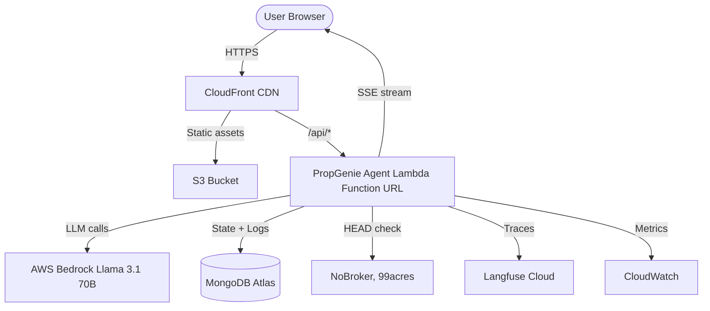

# PropGenie — High-Level Design (Index)

**Version:** 1.1 | **Date:** 2026-05-16 | **Status:** Draft

---

## Document Structure

| # | Section | File | Description |
|---|---------|------|-------------|
| 1 | Executive Summary | [01-executive-summary.md](01-executive-summary.md) | Project overview + design decisions register |
| 2 | System Architecture | [02-system-architecture.md](02-system-architecture.md) | C4 L1/L2 diagrams, request flow, LangGraph topology |
| 3 | Sequence Diagrams | [03-sequence-diagrams.md](03-sequence-diagrams.md) | Happy path, clarification, rate limit breach, 3-round fallback |
| 4 | Components | [04-components.md](04-components.md) | Component inventory table + agent responsibility matrix |
| 5 | API Contract | [05-api-contract.md](05-api-contract.md) | Chat endpoint, SSE event types, rate limit response, health |
| 6 | Data Schemas | [06-data-schemas.md](06-data-schemas.md) | MongoDB collections: sessions, rate_limits, search_logs |
| 7 | NFR Summary | [07-nfr-summary.md](07-nfr-summary.md) | Rate limiting, sessions, streaming, observability, security, perf |
| 8 | Infrastructure | [08-infrastructure.md](08-infrastructure.md) | Terraform resources, module structure, IAM, workspaces |
| 9 | CI/CD Pipeline | [09-cicd-pipeline.md](09-cicd-pipeline.md) | Mono-repo layout, 3 pipelines, GitHub secrets |
| 10 | Risks & Roadmap | [10-risks-and-roadmap.md](10-risks-and-roadmap.md) | Risks with mitigations + prioritized v2 features |

---

## Key Architecture Highlights

## Design Principles

1. **Single Lambda, Single Graph** — All agent logic in one LangGraph graph, one Lambda invocation per user turn
2. **MongoDB for Everything** — Sessions, checkpoints, rate limits, analytics — single data store
3. **Direct Streaming** — CloudFront routes `/api/*` to Lambda Function URL for native SSE streaming
4. **Inline Rate Limiting** — Rate limit check runs inside the agent handler, no separate authorizer
5. **Fail Gracefully** — Invalid URLs dropped silently, errors shown as friendly messages
6. **Privacy by Default** — IP hashed in analytics, raw IP only in TTL-expiring collections
